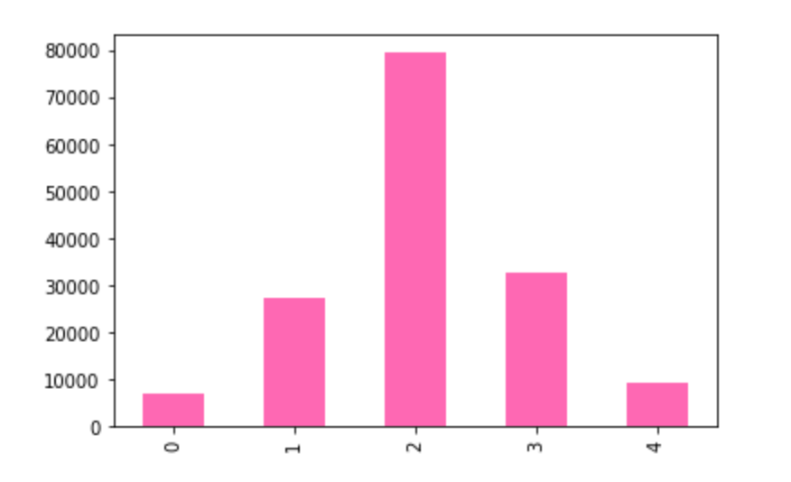
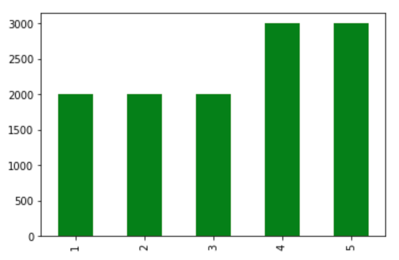
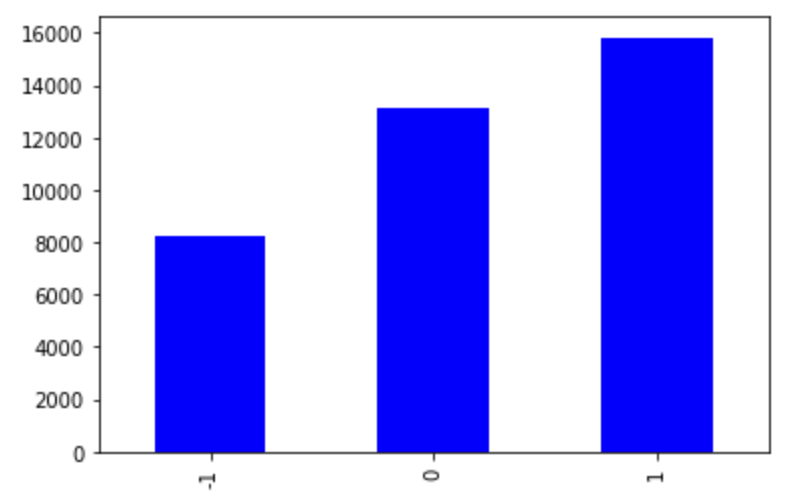

# Introduction

Sentiment analysis is relevant to today’s ongoing advancement with natural language processing using machine learning. From a business standpoint, it is helpful to understand user sentiment toward a company’s products. Culturally, it is also vital to comprehend overall sentiment on social media platforms and identify negative users or communities in these spaces. Therefore, for this project, we want to explore multi-class sentiment analysis using three different datasets that cover these sentiment analysis motivations: 

* Rotten Tomatoes Movie Review: https://www.kaggle.com/c/sentiment-analysis-on-movie-reviews/data
* Amazon Kindle Book Review and Rating: https://www.kaggle.com/datasets/meetnagadia/amazon-kindle-book-review-for-sentiment-analysis 
* Reddit Comments: https://www.kaggle.com/datasets/cosmos98/twitter-and-reddit-sentimental-analysis-dataset?select=Reddit_Data.csv 

The goal of this project is to observe the performances of different sentiment analysis models across these different datasets. We plan to compare and contrast different multi-class classification models such as Decision Tree Classifier model, Random Forest Classifier model, k-Nearest Neighbors Classifier model, and Multinomial Naive Bayes model. We also plan to compare the Logistic Regression model with other multi-class classification models using both One-vs-Rest and One-vs-One techniques. 

Both One-vs-Rest (OvR) and One-vs-One (OvO) classification models are heuristic methods that leverage a binary classification algorithm for multi-class classification. The two are slightly different in such a way that OvR involves splitting the dataset into one binary dataset for each class while OvO splits it into one dataset for each class versus every other class. 

# SetUp 
## Rotten Tomatoes Movie Review: 
The dataset is composed of phrases from the Rotten Tomatoes dataset linked above. Each sentence is parsed into multiple phrases by the Stanford parser. Each sentence has its own SentenceId, and each phrase has its own PhraseId. The dataset is divided into two table files: train.tsv and test.tsv. In both datasets, there is a PhraseId, SentenceId, and a Phrase. The difference between train.tsv and test.tsv is that train.tsv contains the phrases with their sentiment labels while test.tsv only contains phrases. 

The sentiment labels are: 

0 - negative 

1 - somewhat negative

2 - neutral

3 - somewhat positive

4 - positive

The bar chart below visualizes the distribution of sentiment labels in our training data. We can see that the sentiment label with the most rows in our training data is neutral, while the two extremes, negative and positive reviews, appear the least number of times.

## Amazon Kindle Book Review: 
The dataset consists of written reviews, the reviewer ID, helpfulness of the review, overall rating score of the product, and other miscellaneous information. We have decided to use the overall rating score as a synonymous feature to sentiment indices from the aforementioned dataset. The overall rating scores range from 1 to 5, 1 meaning poor and 5 meaning excellent. Because the numerical rating scores are related to how negative or positive the reviewers feel about the product, we decided it was fair to use the scores as sentiment index. 

The following bar graph shows the distribution of the overall rating scores for the entire dataset. We can see that generally, we have equal distribution across different scores. Scores of 4 and 5 have a bit higher distribution than the rest, which indicates that we have more positive reviews than negative/neutral reviews in the entire dataset. 

## Reddit Comments: 
The dataset consists of two columns, the first column has cleaned tweets and comments from Reddit and the second column indicates its sentimental label. 

The bar chart below visualizes the distribution of sentiment labels in our data. We can see that the sentiment label with the most rows in our training data is positive, while negative reviews appear the least number of times.

The sentiment labels are: 

-1 for negative, 

0 for neutral, 

1 for positive

Utilizing Jupyter Notebook and the NEU Discovery cluster, we begin by reading the respective csv/tsv files for each dataset. We then split the loaded data into testing and validation sets to use on the multi-class classification models listed above. After training each model, predictions and scores are calculated using the validation set to gauge model accuracy.

## TfidfVectorizor
For each model, we transform our training and validation datasets using TfidfVectorizer. This tool is widely used in text analyses (which we are conducting a version of) in Python. According to Sklearn documentation, raw data, or the sample dataset of sentences, need to be turned into numerical feature vectors before being fed to algorithms. The TfidfVectorizer vectorizes the sample sequence of symbols by tokenizing the strings, counting the occurrences of tokens in each document, and normalizing and weighting the extracted numerical features with diminishing importance tokens. For some models, we determine the best min_df value to pass through the TfidfVectorizer. Min_df value is the cut-off frequency value which is used to ignore terms with frequency strictly lower than the given threshold.

## MultinomialNB:
For each dataset, we iterated through a list of alpha values ranging from 0 to 1 to determine the best alpha value for the model. As a result, we trained each dataset with the following parameters:
* Rotten-Tomato: alpha = 0.4
* Amazon Kindle Reviews: alpha = 1.0
* Reddit Comments: alpha = 0.7

## Logistic Regression:
As mentioned earlier, this model is mainly used for binary classification. To use this model to conduct multi-class classification, we used both the OneVsRestClassifier and OneVsOneClassifier objects. To further improve upon our results, we iterated over a range of min_df values from 0 to 10 for the TfidfVectorizer, resulting in the following:
* OvR:
  * Rotten-Tomato: min_df = 4
  * Amazon Kindle Review: min_df = 3
  * Reddit Comments: min_df = 10
* OvO:
  * Rotten-Tomato: min_df = 7
  * Amazon Kindle Review: min_df = 10
  * Reddit Comments: min_df = 10

## KNN: 
The parameters we used inside KNeighborsClassifier included n_neighbors to be 5 and the metric to be 'euclidean.' We also iterated over a range of min_df values from 0 to 10 for the TfidfVectorizer, resulting in the following:
* Rotten-Tomato: min_df = 3
* Amazon Kindle Reviews: min_df = 0
* Reddit Comments: min_df = 10

## Decision Tree: 
First, we trained a decision tree model without pruning conditions set. Then we performed cross-validation on max_depth, min_samples_split, and min_samples_leaf to obtain the best combination of those parameters. After using RandomSearchCV, we determined the following to be the best parameters for all three datasets:
* max_depth = 10
* min_samples_split = 6
* min_samples_leaf = 3

## Random Forest:
Similarly, we first trained a random forest model without setting any parameters. Then we performed cross-validation on max_depth and n_estimators to obtain the best combination of those parameters. As a result, we obtained and trained our models with the following values:
* Rotten-Tomato: 
  * max_depth = 2
  * n_estimators = 50
* Amazon Kindle Reviews:
  * max_depth = 10
  * n_estimators = 200
* Reddit Comments:
  * max_depth = 10
  * n_estimators = 200

## Feature Reduction:
While training the various models above with the Rotten Tomatoes Reviews, we have observed very slow runtimes, particularly with more complex models such as decision trees and kNN. We hypothesize that since the Rotten Tomatoes dataset is much larger than the other two, we are left with a very large number of features after vectorization, which could be slowing down our models. Therefore, we attempt to perform feature reduction with the following two methods:
* Setting the max_features parameter in the TfidfVectorizer
* Stemming our training data before vectorization

Because the other two datasets are comparatively smaller, we have decided feature reduction is not necessary for these datasets. Therefore, we only run these feature reduction steps for the first dataset.

# Results 

Multinomial NB: 
|  | Rotten Tomatoes | Amazon | Reddit | 
| --- | --- | --- | --- | 
| Training Error | 0.2536043829296425 | 0.3728125 | 0.2894728011 |
| Validation Error | 0.36764705882352944 | 0.62958333333 | 0.49449664429 | 
| F1 Score | 0.4904695785992418 | 0.2641252723792353 | 0.3574286850799983 |

Logistic Regression (one vs rest):
|  | Rotten Tomatoes | Amazon | Reddit | 
| --- | --- | --- | --- | 
| Training Error | 0.2886950531846726 | 0.1511458333333333 | 0.09651330581563144 | 
| Validation Error | 0.36005382545174935 | 0.4816666666666667 | 0.15288590604026842 | 
| F1 Score | 0.47013799219046853 | 0.4923143078194438 | 0.822511229662286 | 

Logistic Regression (one vs one):
|  | Rotten Tomatoes | Amazon | Reddit | 
| --- | --- | --- | --- | 
| Training Error | 0.3079584775086506 | 0.2348958333333333 | 0.10527198899291923 | 
| Validation Error | 0.36184800717672694 | 0.4854166666666667 | 0.16577181208053693 | 
| F1 Score | 0.4587780704512993 | 0.49426175217768914 | 0.8084570996053896 | 

KNN: 
|  | Rotten Tomatoes | Amazon | Reddit | 
| --- | --- | --- | --- | 
| Training Error | 0.26420126874279126 | 0.38687499999999997 | 0.6033088358669754 | 
| Validation Error | 0.38286556452646414 | 0.59875 | 0.6144966442953019 | 
| F1 Score | 0.4956557510334359 | 0.40018315108907476 | 0.24177103199322678 | 

Decision Tree (without pruning): 
|  | Rotten Tomatoes | Amazon | Reddit | 
| --- | --- | --- | --- | 
| Training Error | 0.04711328976 | 0.0 | 0.0 | 
| Validation Error | 0.4085928489 | 0.6683333333333333 | 0.23718120805369125 | 
| F1 Score | N/A | 0.3213731347115591 | 0.7365181115233602 | 

Decision Tree (after cv): 
|  | Rotten Tomatoes | Amazon | Reddit | 
| --- | --- | --- | --- | 
| Training Error | 0.46406830706 | 0.5615625 | 0.3810194972985671 | 
| Validation Error | 0.47036396257 | 0.65875 | 0.39838926174496647 | 
| F1 Score | N/A | 0.3226514398180975 | 0.5023933545241343 | 

Random Forest (without pruning): 
|  | Rotten Tomatoes | Amazon | Reddit | 
| --- | --- | --- | --- | 
| Training Error | 0.04719338715878507 | 0.0 | 0.0 | 
| Validation Error | 0.35531205946430855 | 0.5608333333333333 | 0.2503355704697987 | 
| F1 Score | 0.5231793837651512 | 0.39489152061137883 | 0.6569924451222134 | 

Random Forest (after cv): 
|  | Rotten Tomatoes | Amazon | Reddit | 
| --- | --- | --- | --- | 
| Training Error | 0.49080481865949 | 0.5871875 | 0.564079331521192 | 
| Validation Error | 0.4870562604126618 | 0.6658333333333333 | 0.5731543624161074 | 
| F1 Score | 0.13561475583414512 | 0.19167211201390977 | 0.21309662082016198 | 

From the results of our decision tree/random forest models, we observe that the model without pruning conditions results in overfitting, as the training set has much higher accuracy than the validation set. After cross-validation and pruning, although the overall accuracy of the model does not improve, we are able to fix the issue of overfitting.

Feature Reduction:
Before feature reduction, we have 93,700 features.

**TfidfVectorizer max_features:**
Max features: 1000
 * Training error: 0.44934640522875813
 * Validation error: 0.44928232731000894
 * F1 score: 0.24441868774297687

Max features: 5000
 * Training error: 0.39462386261694216
 * Validation error: 0.4119569396386006
 * F1 score: 0.35250998376828335

Max features: 10000
 * Training error: 0.3643790849673203
 * Validation error: 0.3979879533512751
 * F1 score: 0.39857440177469183

From these results, we observe that reducing the number of features after vectorizing comes with the cost of a less accurate model.

**Snowball Stemming:**

MultinomialNB:
 * Training error: 0.3755847110085865
 * Validation error: 0.41141227732923236
 * F1 score: 0.3597208642444395

kNN:
 * Training error: 0.26080513904908365
 * validation error: 0.3764898116109189
 * F1 score: 0.5021483017695451

Using Snowball stemming, we are able to reduce the number of features from 93,700 to 10,450. Additionally, in comparison to the previous method, stemming does not have as much of a negative effect on the accuracy of the model.

# Discussion 
As seen in our results, the model with the best performance, having the highest F1 score with a lower risk of overfitting, is Logistic Regression.  The Logistic Regression model performs substantially better than tree-based models as observed because of the fundamental differences between how the two methods work. Logistic regression estimates the probabilities of having different degrees of sentiment based on the set of text inputs. This enables handling both linear and nonlinear relationships between the input and output. And because text data and sentiment often have non-linear relationships, logistic regression is the best model to work with. 

On the other hand, tree-based models are more prone to overfitting than logistic regression models. These types of models split data into smaller subsets based on features, which, in our case, will result in trees that are way too complex. This is especially so when our vectorizer increases the number of features prior to fitting the vectorized data into these models. Not only does it make the models more prone to overfitting, but it also fails to consider the aforementioned nonlinear relationships between text and sentiment.
In addition, the Amazon Kindle Book Review and Reddit Comment datasets are comparatively smaller than the Rotten Tomatoes Movie Review dataset, which means there is less data to train the models. This serves as more evidence of overfitting not only with the tree-based methods but also with the Multinomial Naive Bayes model. 

The performance of the k-nearest neighbors (KNN) model is mediocre relative to that of other models discussed. This model is not as prone to overfitting as the tree-based models, but it still has a lower performance score than the Logistic Regression model. We analyze this to be true due to the way classifications are made in the KNN model. KNN uses Euclidean distance between data points to make classifications. Using Euclidean distance to determine whether reviews using starkly different vocabularies express the same sentiment may not be the best measure, for they may have a large distance between them despite having the same sentiment.

# Conclusion 
This project evaluates the performance of various multi-class classification models, including MultinomialNB, One-vs-Rest and One-vs-One Logistic Regression, K-nearest neighbors, Decision Tree, and Random Forest, for sentiment analysis. We do so by training and testing these models on three different sentiment analysis datasets, utilizing cross-validation to select the best hyperparameters to yield the best results. Additionally, for much larger datasets, we explore the possibilities of feature reduction. From this, we conclude that limiting the maximum number of features for our vectorizer has a greater negative effect on the accuracy of our models while stemming allows us to significantly reduce the number of features without having a detrimental impact on our accuracy scores. Furthermore, an analysis of each model’s performance leads us to conclude that comparatively, Logistic Regression is most suitable for sentiment analysis because it is befitting of the nonlinear relationships between sentiment labels and their associated text, and it is not as prone to overfitting as some of the other models used in this project.

# Reference 
https://www.kaggle.com/c/sentiment-analysis-on-movie-reviews/data 

https://www.kaggle.com/datasets/cosmos98/twitter-and-reddit-sentimental-analysis-dataset?select=Reddit_Data.csv 

https://www.kaggle.com/datasets/meetnagadia/amazon-kindle-book-review-for-sentiment-analysis 

https://www.kdnuggets.com/2020/08/one-vs-rest-one-multi-class-classification.html 

https://www.datacamp.com/tutorial/stemming-lemmatization-python

